# Klipper on BabyBeltPro

This guide was written using the SKR mini E3 V3. For users flashing Klipper for the first time, please see the manufacturer's documentation [here](https://github.com/bigtreetech/BIGTREETECH-SKR-mini-E3/blob/master/firmware/V3.0/Klipper/README.md)
If you are following this section, please use the configuration files from the [Angle Switch Included](../Software/Firmware/klipper/angle_switch_included) Klipper Folder
Additionally, it is recommended to use a pre-built Klipper image to have many of the Klipper related items preinstalled and preconfigured for you. We don't judge if you use Fluidd or Mainsail either 😉  

Table o' Contents
- [BOM Differences](#bom-differences)
- [Printed Part Changes](#printed-part-changes)
- [Degree Sensor Switch Wiring](#degree-sensor-switch)
- [Installing the Switch](#installing-the-switch)
- [Screen Changes](#screen-changes)
- [Validation](#validation)

## BOM Differences
- Remove BTT-TFT35-E3-V3.0 screen
- Add BTT Pi TFT50 (Preferrably v2.1)
- Add 1 Omron D2F-5L (or similar)
- Add 2x M2x10 Self Tapping Screws
- Add 3x M3x5x4 Heat set inserts
- Add 3x M3x14 SHCS
- Add 1x (300mm) Pi TFT Cable (Prefer Adafruit as the cable backer is shorter) 
  - Stock has a 5mm tall Backer, Amazon Special has 7mm Backer. You can trim this yourself if you are INCREDIBLY careful when both peeling up from the back and cutting, I take no responsibility if you damage your cable by modification.
- Approximately 160mm of 24AWG stranded wire
- JST-XH Female Crimp ends (SXH-001T-P0.6 or SXH-001T-P0.6N)
- JST-XH 3-wire housing (XHP-3)
- For the new X Belt Clamp (if the original BOM has not been updated)
  - 4 M3x10 (You can use whatever cap you like, I think BHCS looks best) * These are for the X Axis Belt Clamps
  - 4 M3x20 SHCS (These are to adjust your tension on both sides & to act as a pivot arm)
  - 6 M3 Normal Nuts

## Printed Part Changes
There are a few key differences in the assembly of the Baby Belt Pro for Klipper, the main differences are the front screen mount and a sensor switch. 

[Front Screen](../STLs/Frame/Mods/Klipper%20PiTFT50%20Screen/Klipper%20Screen%20Mount.stl)  
[Screen Cartridge](../STLs/Frame/Mods/Klipper%20PiTFT50%20Screen/Screen%20Cartridge%20-%20BTT%20PI%20TFT50%20v2%20cover.stl)

## Degree Sensor Switch
Take the 28AWG wire and strip a small portion of it, solder a wire to each of the outer legs of the switch as seen here.  
After you have connected them, add your crimp ends then gently twist the two wires to keep things nice and tidy. When you have reached the end of the wires, grab the JST 3 pin Wire housing and insert them in the right two spots if viewing the connector in a "pins up" orientation [see here](#xhp-3-wiring).   
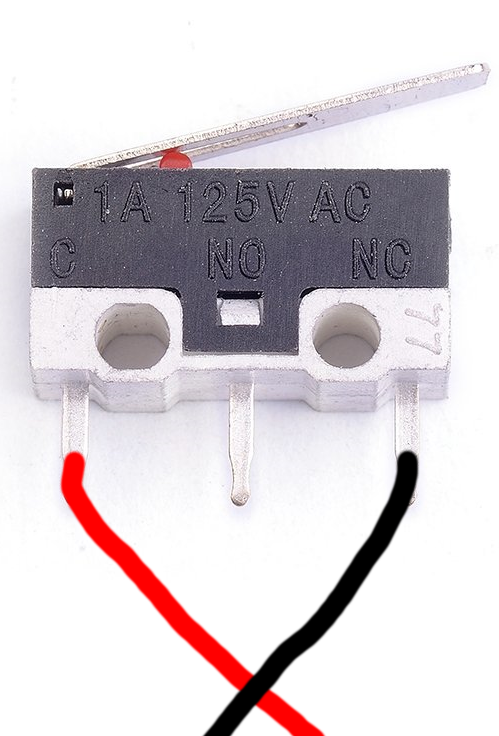

## XHP-3 wiring

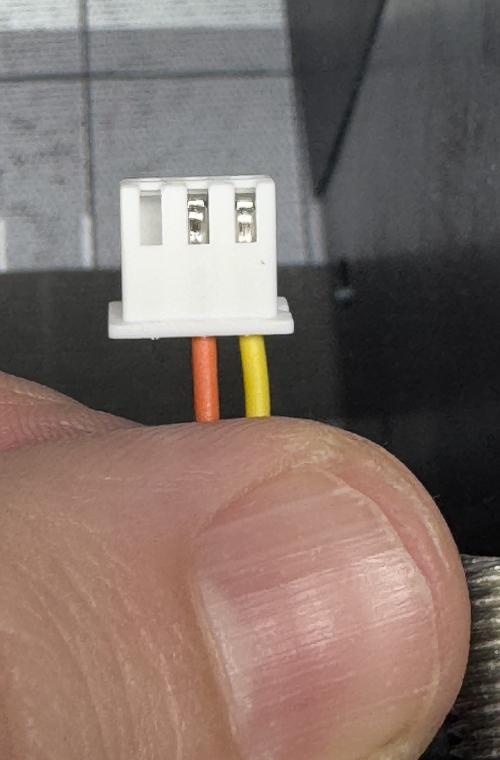

## Installing the switch
Next, on [Side A](../STLs/Frame/BBProV25fl_Side-A.stl) if you are using an existing part, take the D2F-5L switch and place it so that the face of the plastic is aligned with the front face of the case and the protruding side of the lever is closer to you.  

Front View  
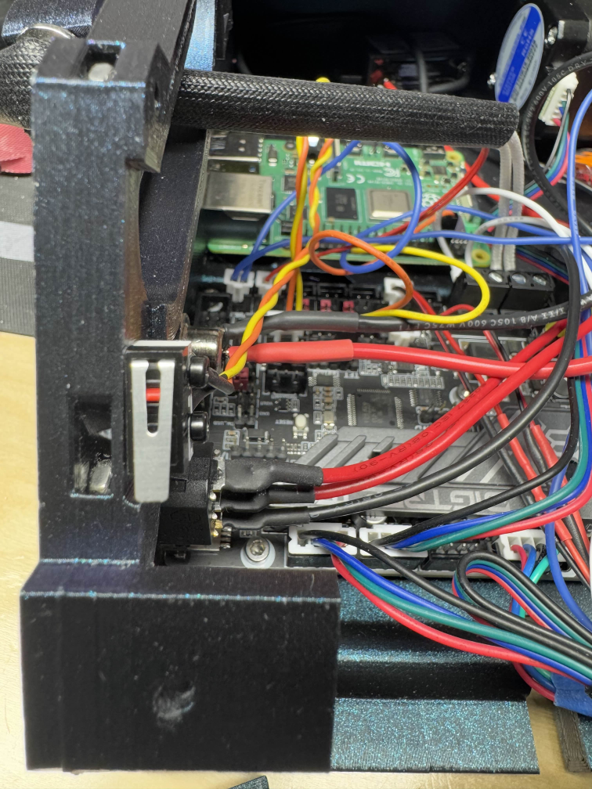  
Outside View  
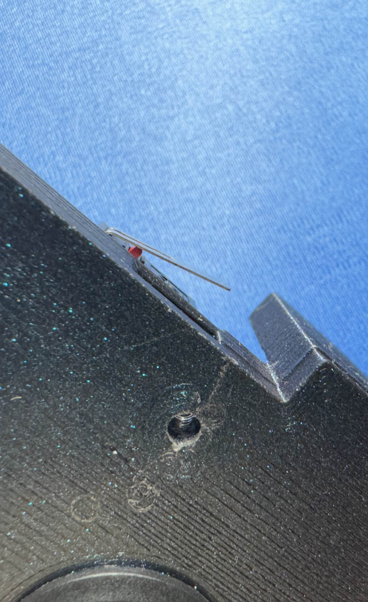  
Inside View  
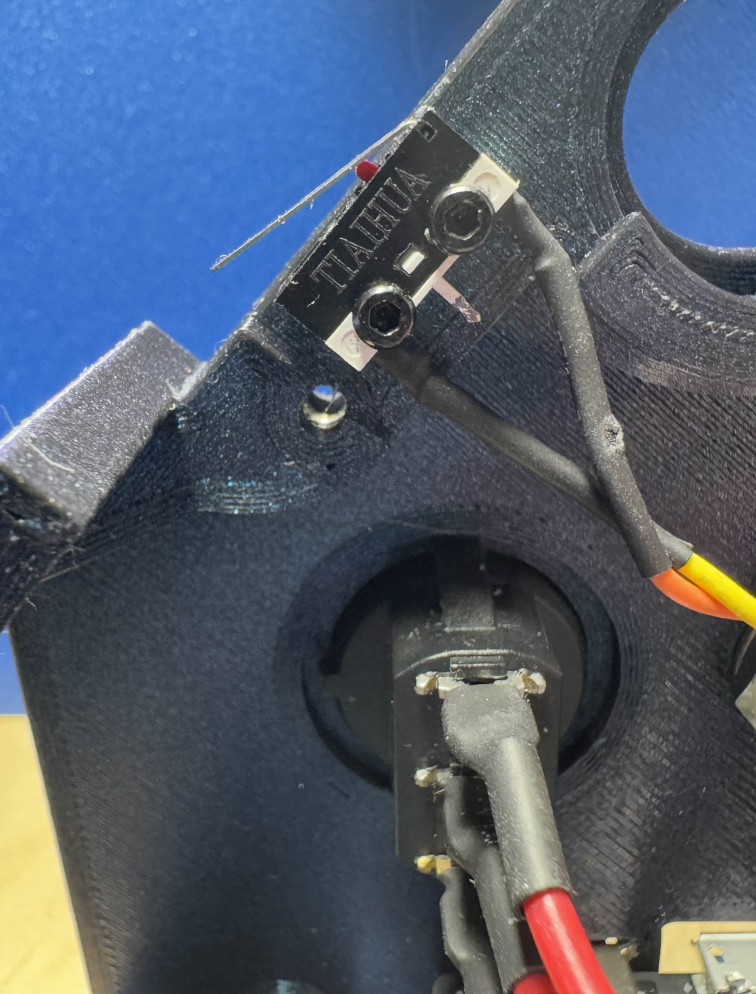  

Next take the other end of the wire, now crimped and in it's housing and plug it into the main board.  
We will be using the E0-STOP port highlighted here in green.  
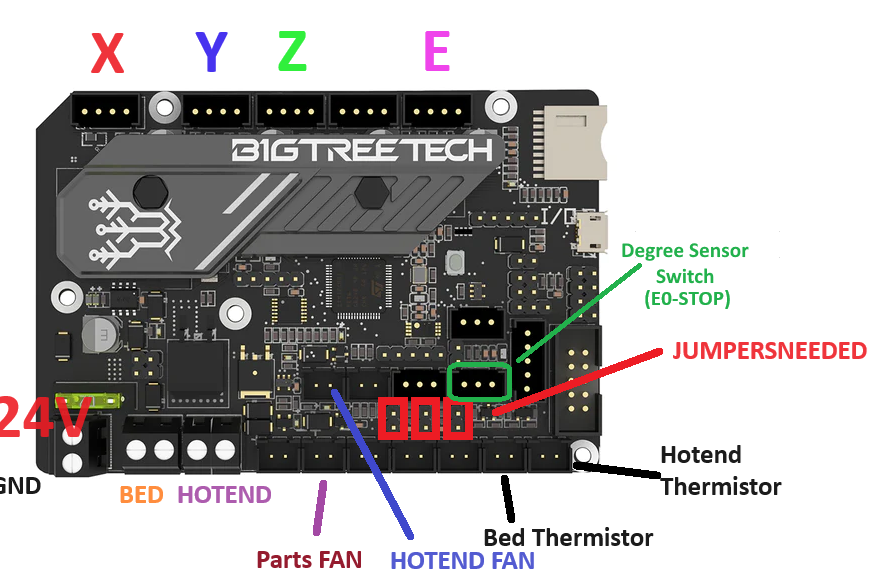


## Screen Changes
Now we get to the fun part! First thing's first, take your [Screen Cartridge](../STLs/Frame/Mods/Klipper%20PiTFT50%20Screen/Screen%20Cartridge%20-%20BTT%20PI%20TFT50%20v2%20cover.stl) and set your heatset inserts into both sides, making sure to put them in as straight as possible.   
Next we grab your BTT Pi TFT50 v2.1 (If you have wheels instead of buttons it should still fit, but this was all tested/validated on a 2.1 with just buttons) and the TFT Cable. insert one end into the screen with the pins facing up and then ensure it is locked in place with the lever down.  
Then set your screen into the cartridge case cable side first, it is going to fold it a little and that's fine. Once you have the cable side set in, pull the excess of the cable through the opening in the back and gently set the other side down. It should fit fairly flush with 0 force (see below)  
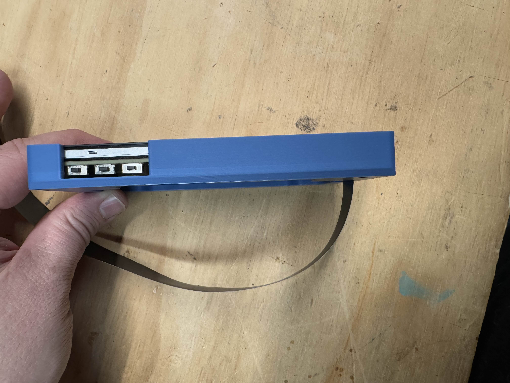  

Now we want to set it down on the screen so we can secure it to the cartridge. If you have the screws that came with it those are great! If you are like me and lost them... well I have good news! An M2.5 x6 BHCS will do the job just as good!
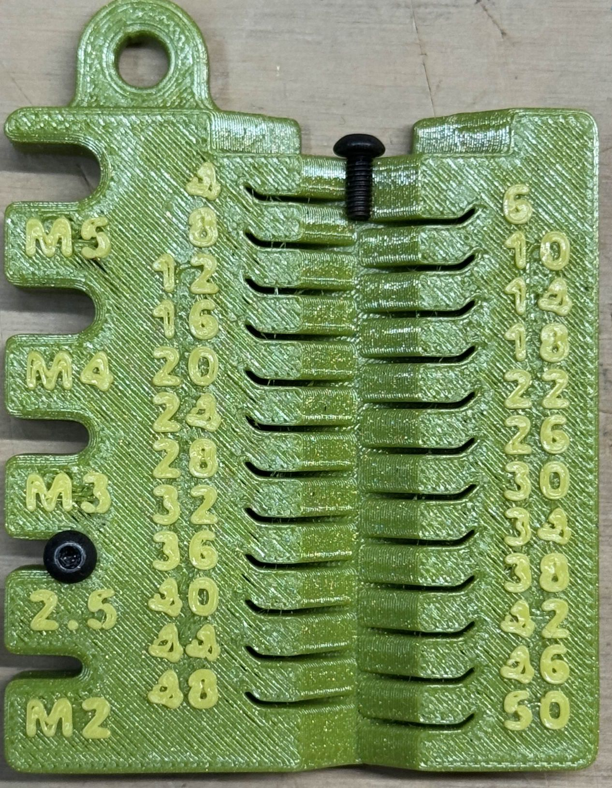

Pick a Corner to start with, then go diagonally across, up and then diagonally back down (see picture)  
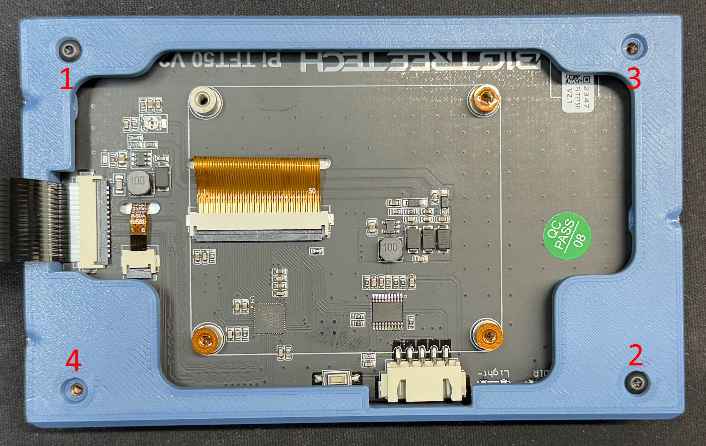  

Congrats! You've got a Screen Cartridge! If this were some other guide we'd tell you to eat a piece of candy.   

Moving on, we need to slot our screen cartridge into the housing, this can be a bit tricky but if you are careful it will be just fine.  
We want to take the cable that is currently connected inside our "screen cartridge" and feel it into the bottom slot of the screen holder.  
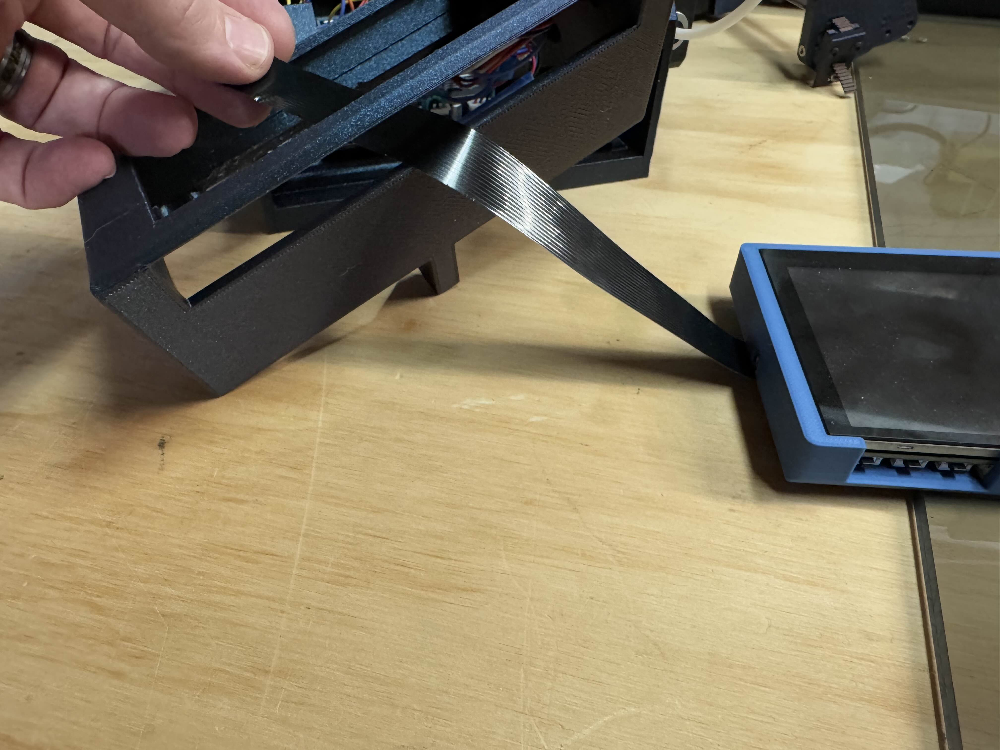

Next tuck it around the back of the screen and carefully hold it with a finger while you start inserting the screen cartridge into the holder. 
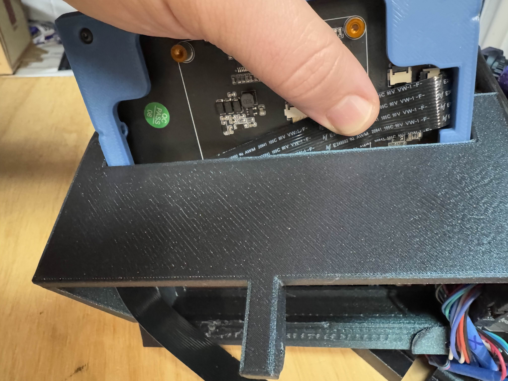  

Once you have inserted past the flex cable section of the screen you can let go of the cable and insert the screen the rest of the way in. Your cable should be towards the back of the housing and you should have access to the buttons from the cutout in the cartridge as seen here  
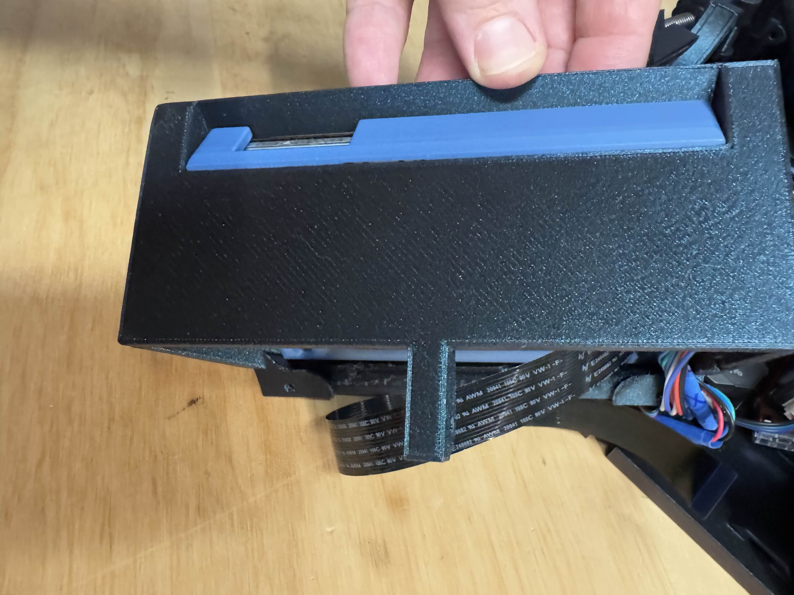  

Next you will want to screw in the side Screws (M3x14 SHCS Qty: 3) start with the side with a single hole and just get it started without screwing all the way in.  
Then insert the upper screw on the other side and get it started, finally the bottom screw on that same side. If everything lines up, tighten all three screws down.  
If they do not all insert, see if you have to push the cartridge ever so slightly to get it to line up, if not check that you inserted the cartridge correctly and that all of your heat sets are as straight as possible.

Finally, Insert the other end of the flex cable into the raspberry pi's display port, pull up on the tab without removing it, and insert the cable We want to ensure we are giving the pins the raspberry and then push the tab back down to lock the cable in place.  
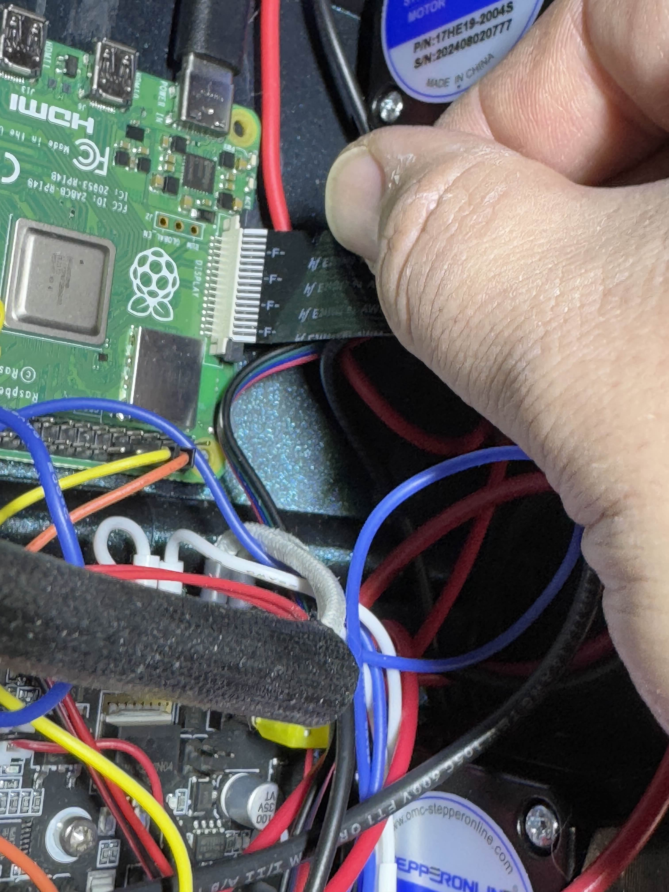


## Validation
Fire up the machine and ensure everything works!

Firstly the screen should turn on immediately, and you should see the Pi booting up!   
If it is upside down, press the middle button on the bottom of the Pi TFT50 to rotate it.

If you see the Pi Booting up, but it stays at a terminal you need to install KlipperScreen. I suggest installing it via [KIAUH](https://github.com/dw-0/kiauh)

If you can see the interface, but touch is not working AT ALL you will need to modify your /boot/config.txt
```bash
sudo nano /boot/config.txt
```

and change the line that has   
```bash
dtoverlay=vc4-kms-v3d
```  
to  
```bash
dtoverlay=vc4-fkms-v3d
```  


If you have any other problems, open an issue here on GitHub or reach out on the Baby Belt Discord. 