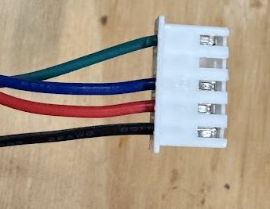
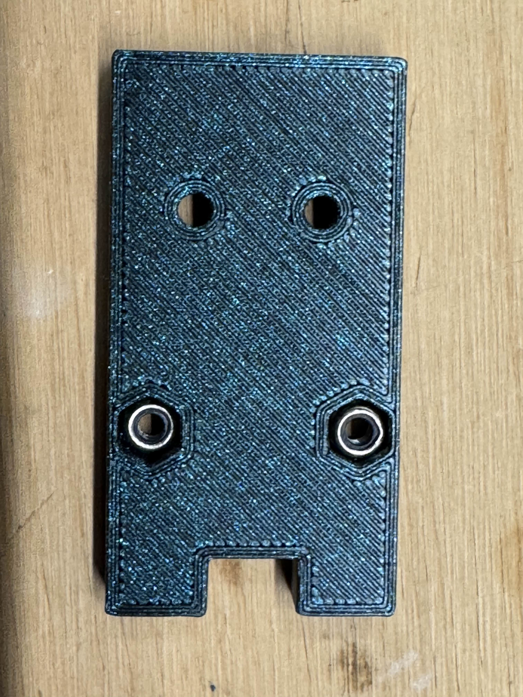
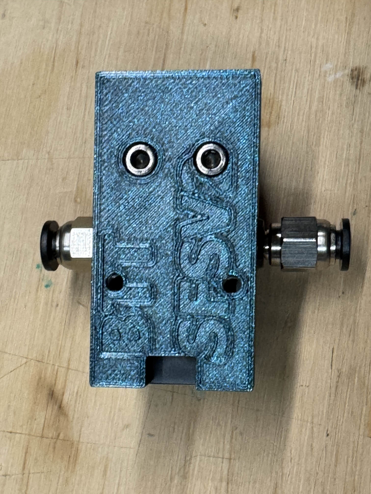
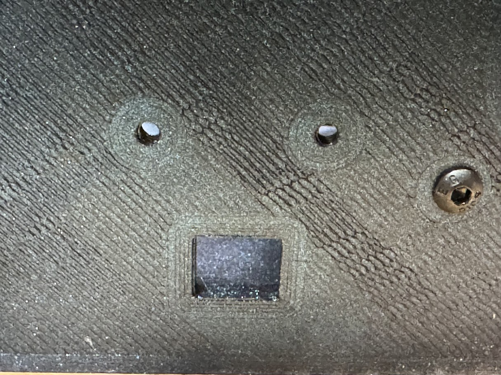
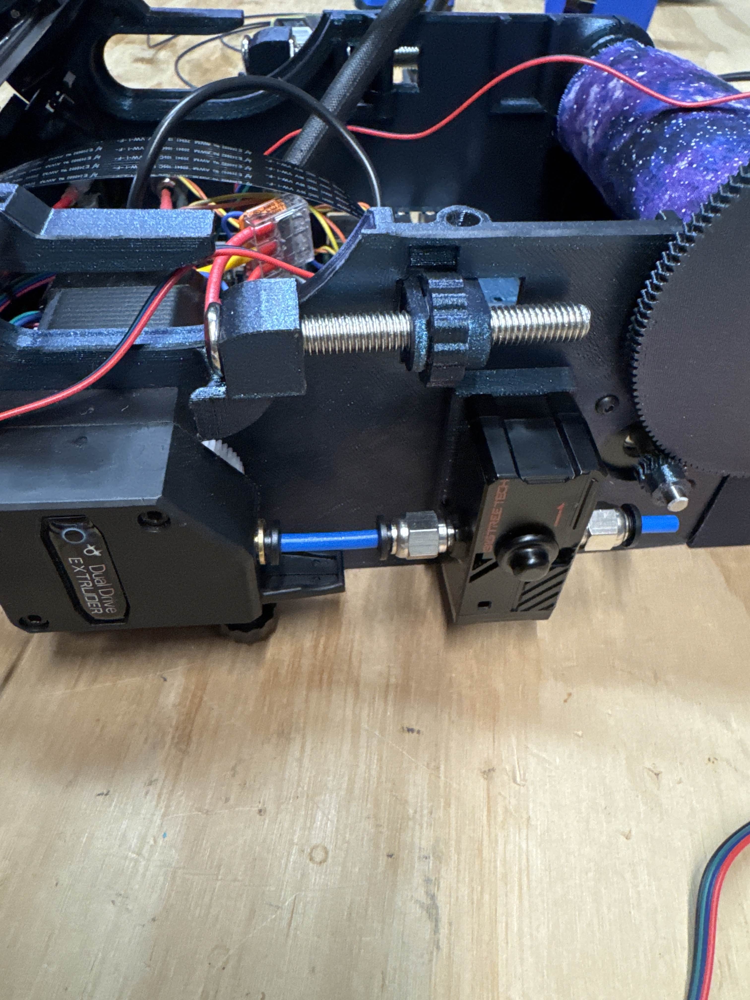

Table o' Contents
- [BOM](#bill-of-materials)
- [Wiring](#wiring)
- [Printed Parts](#printed-parts)
- [Assembly](#assembly)
- [Config Changes](#config-changes)

## Bill of Materials
| Part                   | Qty | Note                                               |
|------------------------|:---:|----------------------------------------------------|
| BTT SFS V2             |  1  | The Actual Product                                 |
| M3x10 BHCS             |  2  | BHCS Preferred but can use SHCS                    |
| M3x6 SHCS              |  2  | Included in BTT Package                            |
| 30mm PTFE Tube         |  2  | Included in BTT Package                            |
| M3 Nylock Nut          |  2  | Can use Normal Nuts but Nylock will have less play |
| 5 pin JST-XH Connector |  1  | *** For SKR Mini E3 V3 ***                         |
| 2 pin JST-XH Connector |  1  | *** For SKR Pico ***                               |

## Printed Parts
First things first, we will need to take a few pins out from the existing connector. There are a number of depinning tools you can print out there. Some with mixed results....  
[JST XH Extractor by Gato](https://www.printables.com/model/353431-jst-xh-extractor)  
[JST-XH Depinner by GMagician](https://www.printables.com/model/480585-jst-xh-depinner)  
[JST-XH.2 Connector Depinner by Micro Center](https://www.printables.com/model/394200-jst-xh2-connector-depinner)    
[JST Connector Depinner by Rafa](https://www.printables.com/model/613127-jst-connector-depinner)  

And Of course you will want the [BTT SFS V2 Mount for Baby Belt Pro](/STLs/Mods/BTT%20SFS%20v2%20Mount.stl)

## Wiring
The Sensor Wire comes with the wires set up into two JST connectors. For the SKR Mini E3 V3 we will want to de-pin ALL the wires
in a "Pins Up / Wires left" view of the JST connector you will want the following order from Top to Bottom (As Seen here)

| Wire Color |
|------------|
| Green      |
| *EMPTY*    |
| Blue       |
| Red        |
| Black      |



This will plug into the Z-Probe Port on the board

For the SKR Pico you will use one of the existing connectors and because you have multiple places you *Could* put a ground there are different wire orders that are acceptable  

2 Pin Connector 

| Wire Order A  | Wire Order B |
|---------------|--------------|
| Blue          | Blue         |
| Black         | **EMPTY**    |

3 Pin Connector  

| Wire Order A  | Wire Order B |
|---------------|--------------|
| Green         | Green        |
| Red           | Red          |
| Black         | **EMPTY**    |

(No Picture Yet)

The 2 pin connector will plug into the PROBE port and the 3 pin connector to the SERVOS port on the SKR Pico

## Assembly

Step One is to grab your printed part and your choice of nuts, insert the nuts as seen here. (Nylock shown)  
  

Next, Grab the Sensor and the 2 M3x6 SHCS  
Place the Mount on the rear of the sensor with the text facing up as shown, and use the 2 M3x6 SHCS to connect the two pieces
You can attach your two PC4-M6 Pneumatic connectors from the package and screw them into both ends of the sensor unit as well  


Before you attach the sensor to the Baby Belt Pro "Tub", you will want to run the wire to your board and out through the square opening near the extruder    


Check to ensure you can smoothly fit a M3 screw through both of the holes shown above, if not carefully ream them until it is easy to fit your M3 screw in. 

Take the Blue PTFE Tubes from the BTT Package and place them into both sides of the sensor, fitting the one loosely into the extruder as you place the sensor in place.  
You will then screw the 2 M3x10 screws from the inside of the tub into the printed mount. and it should look something like this.  



## Config Changes
Once you have your wires in the correct setup for your board, You can grab our [options folder](/Software/Firmware/klipper/options) and add one or both of the following includes to your printer.cfg you will be good to go  
```aiignore
[include options/BTT_SFS_V2_MOTION.cfg] # Enable the motion sense feature of the BTT Smart filament Sensor V2
[include options/BTT_SFS_V2_SWITCH.cfg] # Enable the filament loaded feature of the BTT Smart filament Sensor V2
```