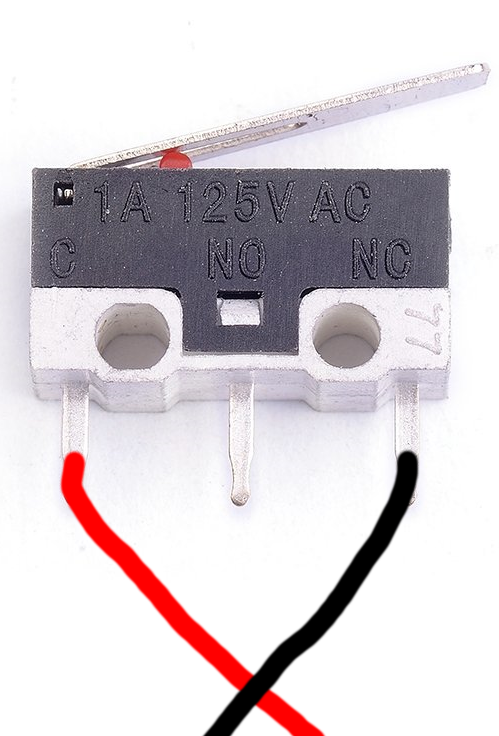
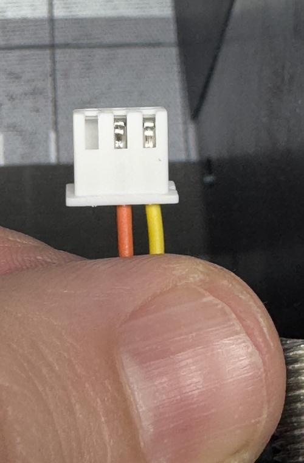
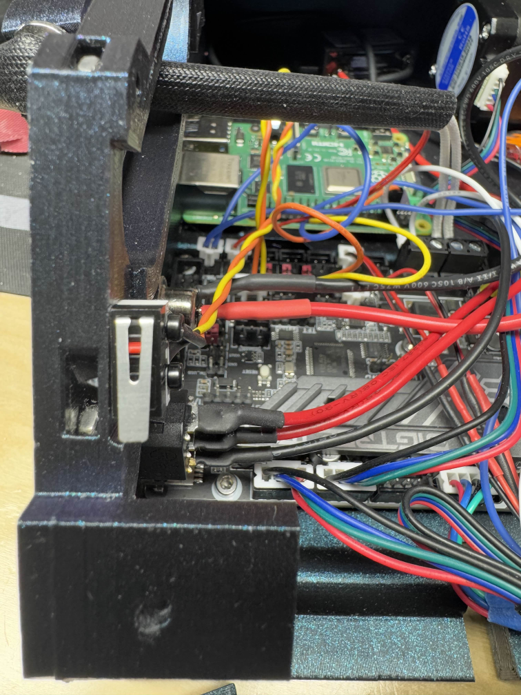
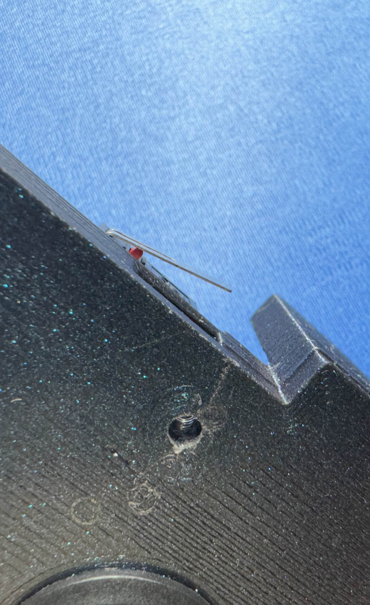
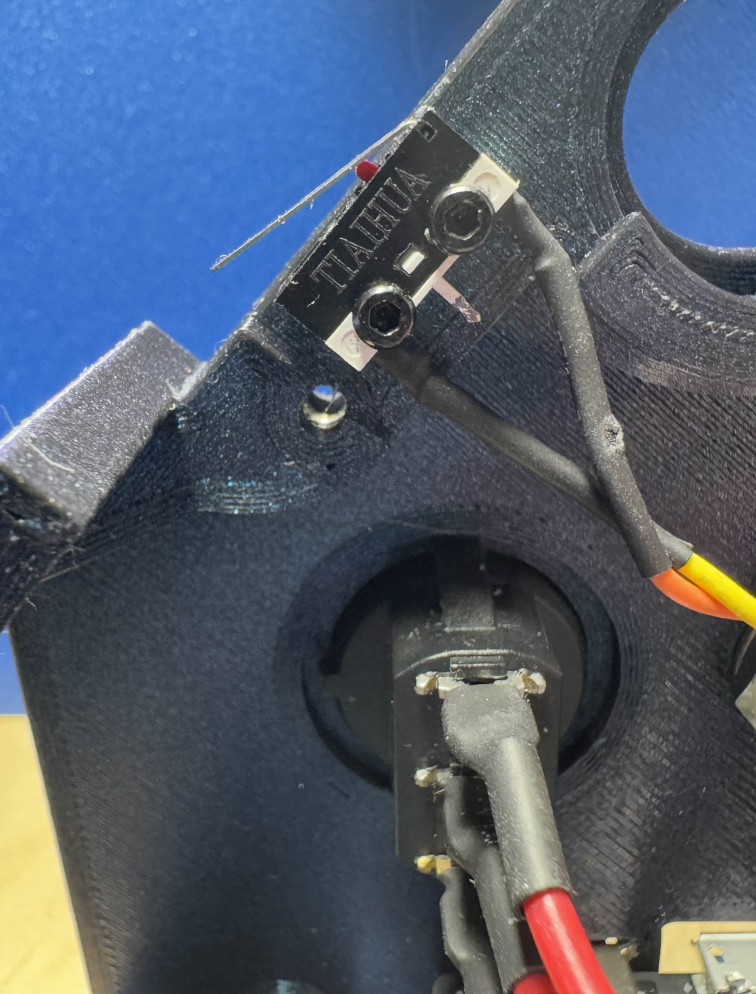
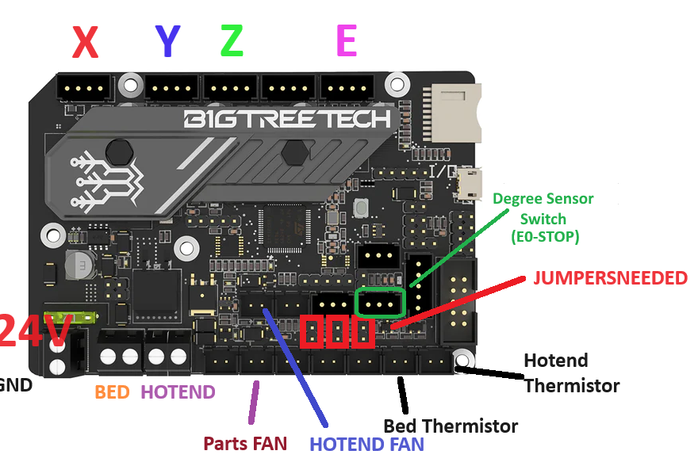

Table o' Contents
- [BOM Differences](#bom-differences)
- [Degree Sensor Switch Wiring](#degree-sensor-switch)
- [Installing the Switch](#installing-the-switch)
- [Config Changes](#printercfg-changes)
- [Validation](#validation)

## BOM Differences
- Add 1 Omron D2F-5L (or similar)
- Add 2x M2x10 Self Tapping Screws
- Approximately 160mm of 24AWG stranded wire
- JST-XH Female Crimp ends (SXH-001T-P0.6 or SXH-001T-P0.6N)
- JST-XH 3-wire housing (XHP-3)

## Degree Sensor Switch
Take the 28AWG wire and strip a small portion of it, solder a wire to each of the outer legs of the switch as seen here.  
After you have connected them, add your crimp ends then gently twist the two wires to keep things nice and tidy. When you have reached the end of the wires, grab the JST 3 pin Wire housing and insert them in the right two spots if viewing the connector in a "pins up" orientation [see here](#xhp-3-wiring).   


## XHP-3 wiring



## Installing the switch
Next, on [Side A](../../../STLs/Frame/BBProV25fl_Side-A.stl) if you are using an existing part, take the D2F-5L switch and place it so that the face of the plastic is aligned with the front face of the case and the protruding side of the lever is closer to you.

Front View  
  
Outside View  
  
Inside View  


Next take the other end of the wire, now crimped and in it's housing and plug it into the main board.  
We will be using the E0-STOP port highlighted here in green.  


## printer.cfg changes
```jinja
[gcode_button 45_deg_check]
pin: PC15 #This is the setting for the SKR E3 Mini V3 using the E0STOP
press_gcode: SET_GCODE_VARIABLE MACRO=Y_ANGLE VARIABLE=state VALUE="45"
release_gcode: SET_GCODE_VARIABLE MACRO=Y_ANGLE VARIABLE=state VALUE="30"
```

## macros.cfg changes
You could also put these in your printer.cfg if you do not have macros.cfg broken out
```jinja
[gcode_macro PRINT_START]
# Reference https://github.com/KevinOConnor/klipper/blob/master/docs/Config_Reference.md#gcode_macroA
# On how to override default parameters
#default_parameter_BED_TEMP: 60
#default_parameter_EXTRUDER_TEMP: 200

gcode:
    
    
    
    
    

    #Uncomment the line below if you need to see the values and troubleshoot
    #RESPOND PREFIX="Debug - Y_angle_state: '{y_angle_state}' requested: '{ANGLE}'"
    
    
        RESPOND PREFIX="Angle Verified... Continuing to Print!"

        G90 ; use absolute coordinates
        M83 ; extruder relative mode
        G28 ; home all axis

        M104 S150                      ; preheat nozzle to 150C
        M117 Heating Bed
        M190 S{BED}                    ; heat bed
    
        #Probe Everytime
	    #G29 
	    #load saved mesh at print start instead of probe. Uncomment to use but comment out G29
	    #BED_MESH_PROFILE LOAD=default
    
        M117 Heating Nozzle
        M109 S{EXTRUDER}               ; heat nozzle
        M190 S{BED}                    ; confirm bed temperature
        M117 ;Clear the message?
    
        # Move the nozzle near the bed
        G1 X0 Y0 Z5 F3000
        PRIME_RIGHT
        G0 Z5 F3000
        G21 ; set units to millimeters
        G90 ; use absolute coordinates
        M83 ; use relative distances for extrusion
        G92 E0
        
    
        RESPOND PREFIX="Your Angle is set to {y_angle_state}, but you sliced for {ANGLE}"
        CANCEL_PRINT
        
    
    
    [gcode_macro Y_ANGLE]
    variable_state: "30"
    gcode:
        RESPOND PREFIX="Y Angle is: {state}"
```


## Validation
Validation is simple, keep your X axis assembly off, power up the printer. Press the button and look at the console.  
It should read
```aiignore
Y Angle is: 45
```

When you let go it should read
```aiignore
Y Angle is: 30
```