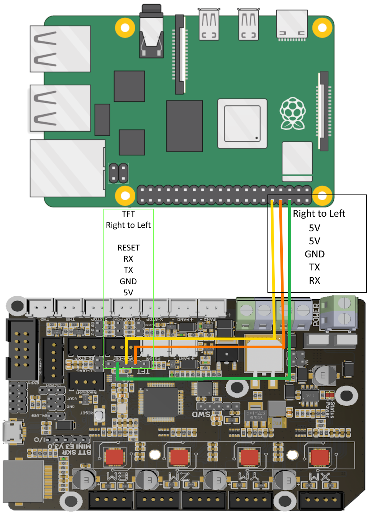
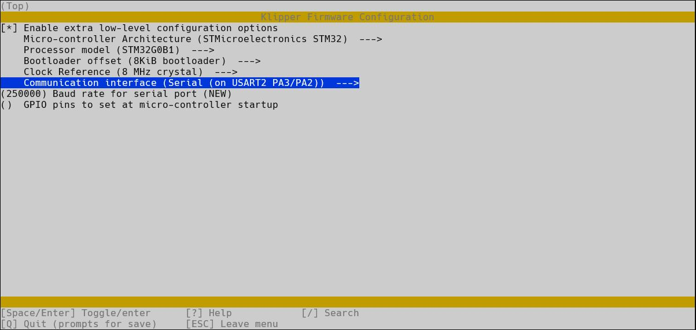
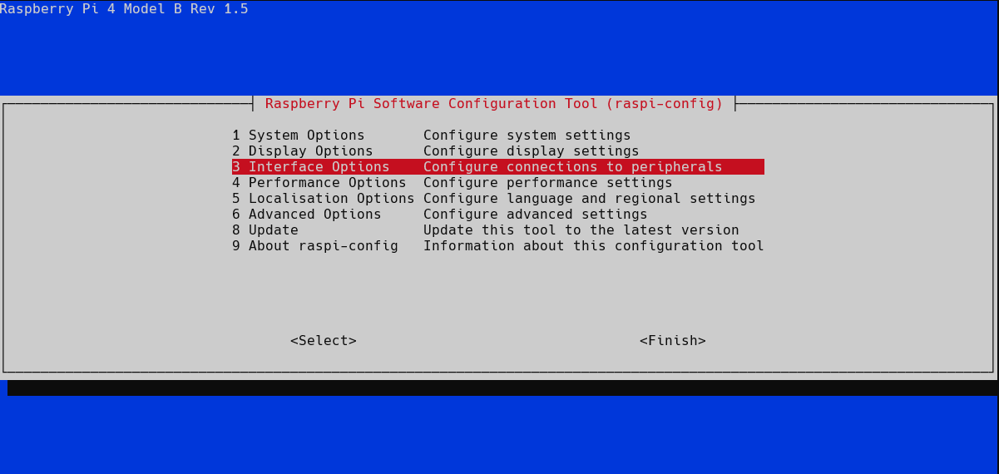
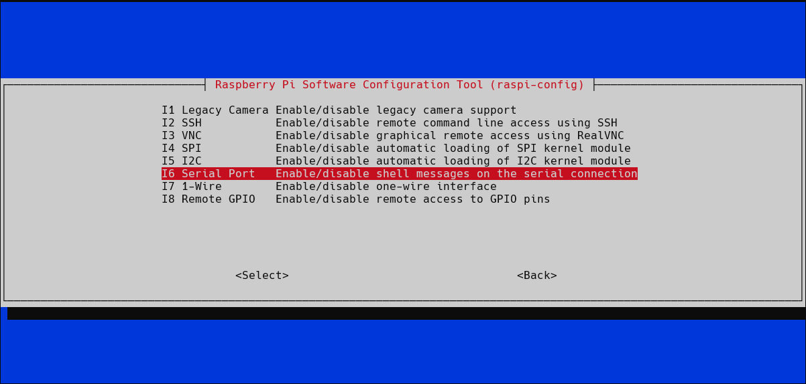
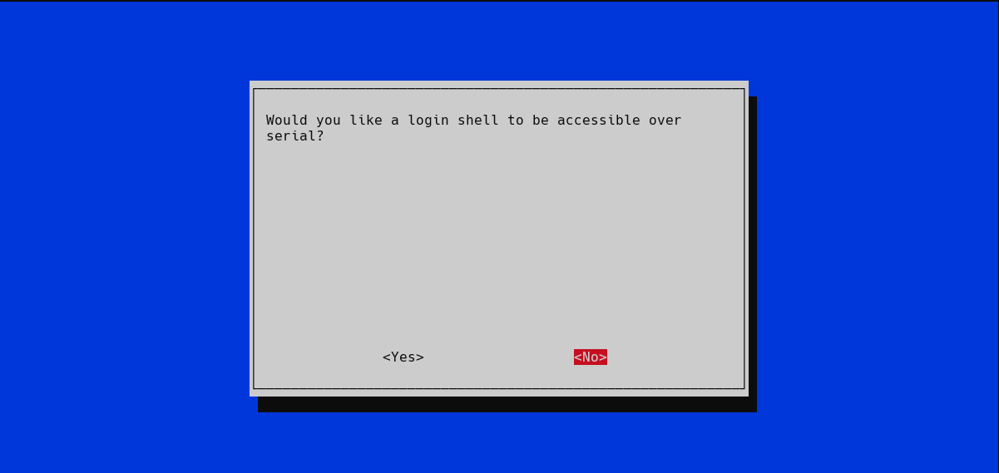
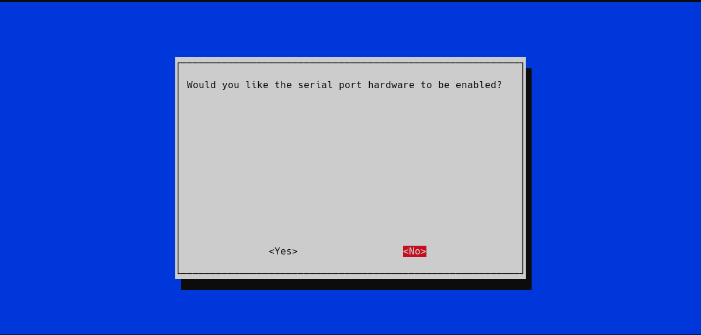
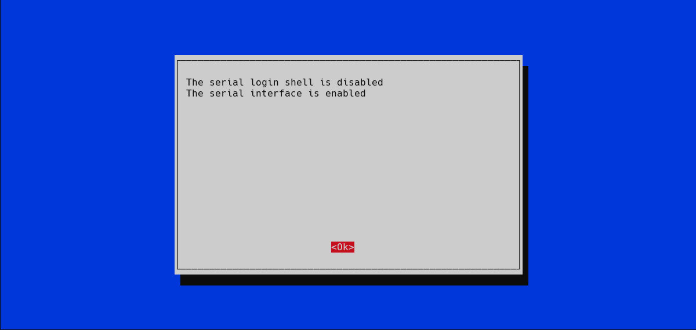
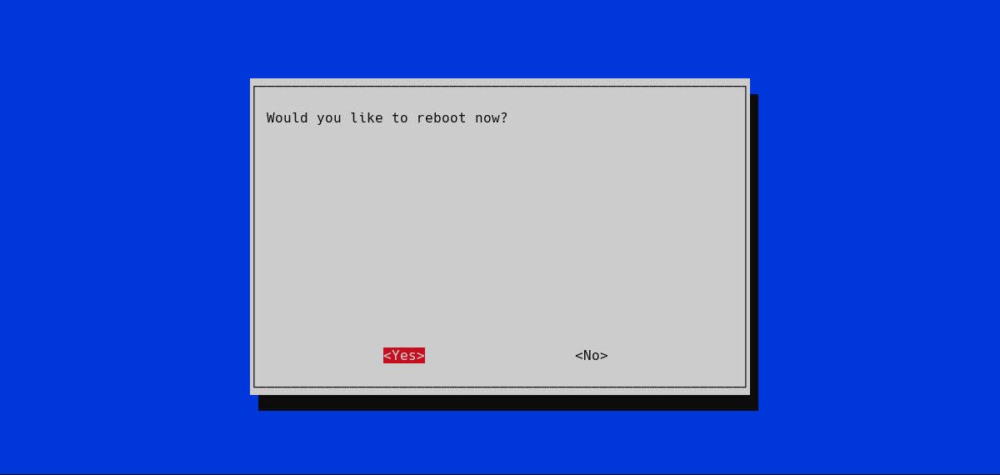

# UART Connection Pi => SKR Mini E3 V3
So you want to keep more wires internal to the Baby Belt eh?
Great news! It's SUPER Simple!

Table o' Contents  
- [Wiring](#wiring)
- [Klipper Changes](#klipper-changes)
- [Pi Changes](#pi-changes)

## Wiring
Grab yourself a trio of wires (I used 26 AWG) roughly around 16cm in length  
and crimp both ends as Female Dupont connectors.
(You can also use individual female to female jumper wires if you have them from a breadboard kit)  

Next you will need to locate the pins in question and Remember that pins go to the opposite signal on either end of the cable.    
TX  => RX  (Orange)  
RX  => TX  (Yellow)  
GND => GND (Green)  


On a Raspberry Pi 3/4 you will be using pin 6 as GND (Green), pin 8 as TX (Orange), and pin 10 as RX(Yellow).
and on the SKR Mini E3 V3, you will need to use three of the TFT pins (see diagram)  

  
**Previous versions of this guide used only two wires (no ground).  Some users reported issues with serial connectivity without the interfaces sharing a common ground.  Thank you to discord user @Sturn for the find!

## Klipper changes
* Instructions are specific to SKR Mini E3 V3 with regard to Flashing
Klipper will need to be re-flashed to your board if it is already flashed. Be advised that you will use a microsd card that is formatted to fat32 and empty before we start
next build your Klipper firmware   

The Key difference here is we want to use Serial on USART2 PA3/PA2 for our communication interface (see below)
  

You will also need to update your mcu section of your printer.cfg to use   
```
/dev/serial0
```  
as your serial connection to the board. If for some reason /dev/serial0 isn't working, you can try /dev/ttyAMA0 if that is still not working, see the following Raspberry Pi Changes to enable the serial interface  

## Pi Changes
Remember that raspi-config command? No? Ok well we need to ssh into our Pi and run the following  
```
sudo raspi-config
```  
** This WILL Prompt you for your password, it's safe to enter it here **   
In this menu you will need to select option 3 Interface Options  
  
then I6 for Serial Port  

You do not need to have the login shell accessible over serial

you *DO* however want the serial interface to be enabled  

press Ok on this confirmation screen, then press the right arrow twice to get to finish and press enter again to exit raspi-config

it will ask if you want to reboot now, go ahead and say yes
