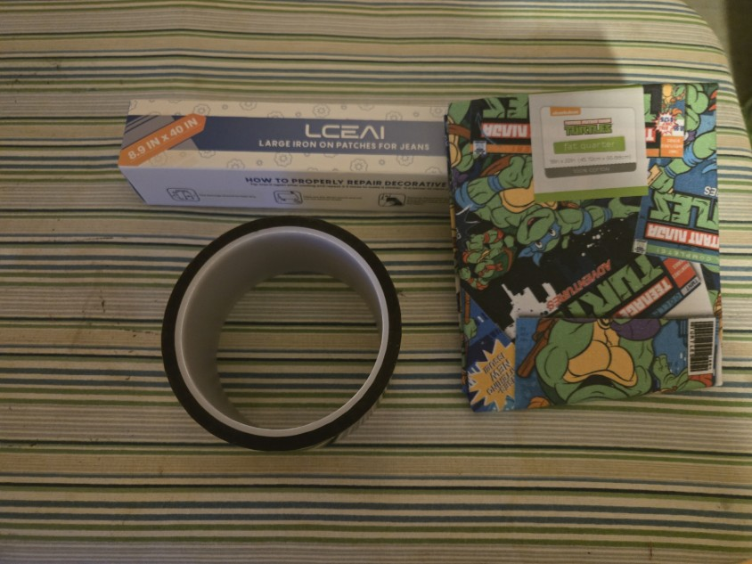
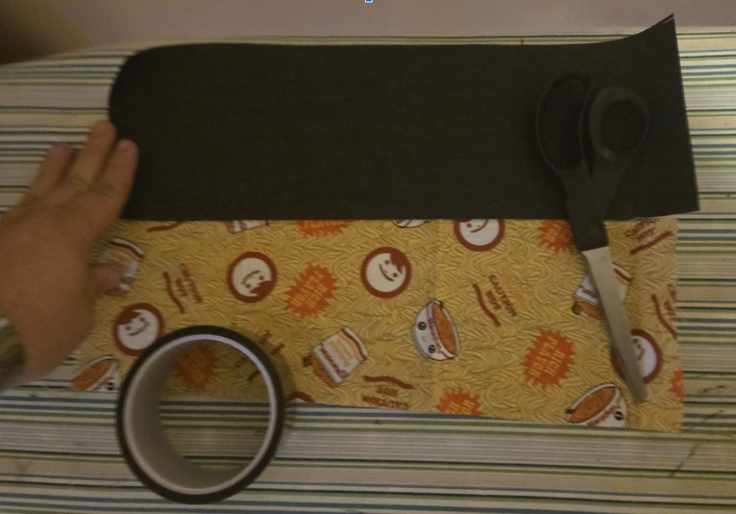
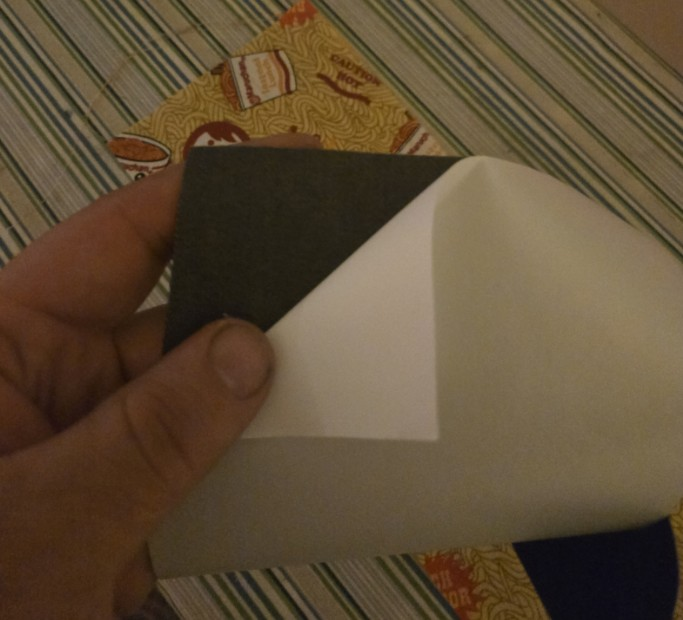
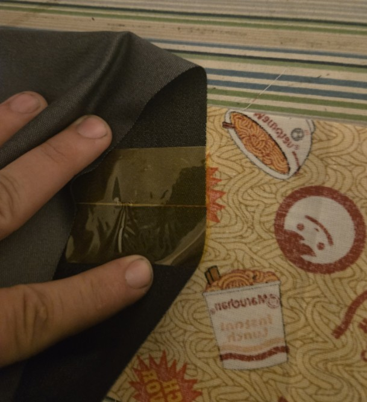
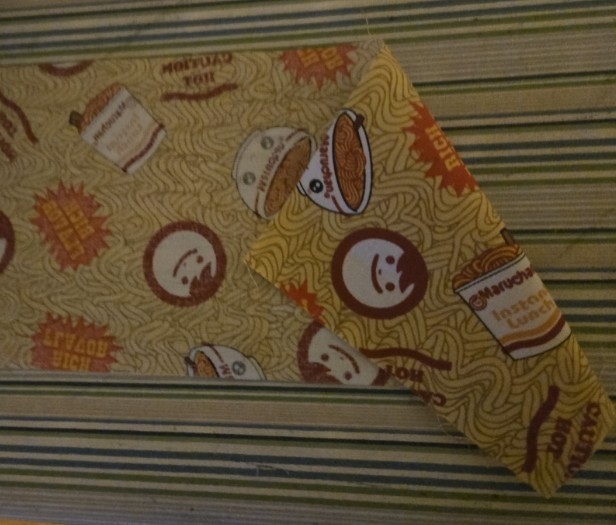
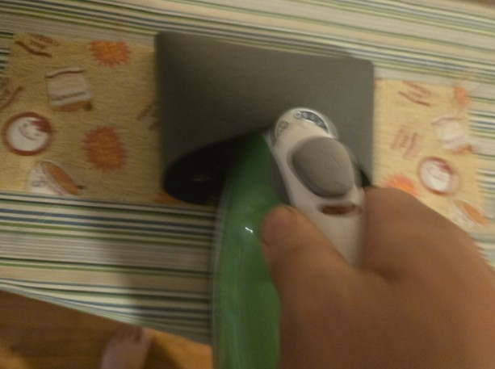
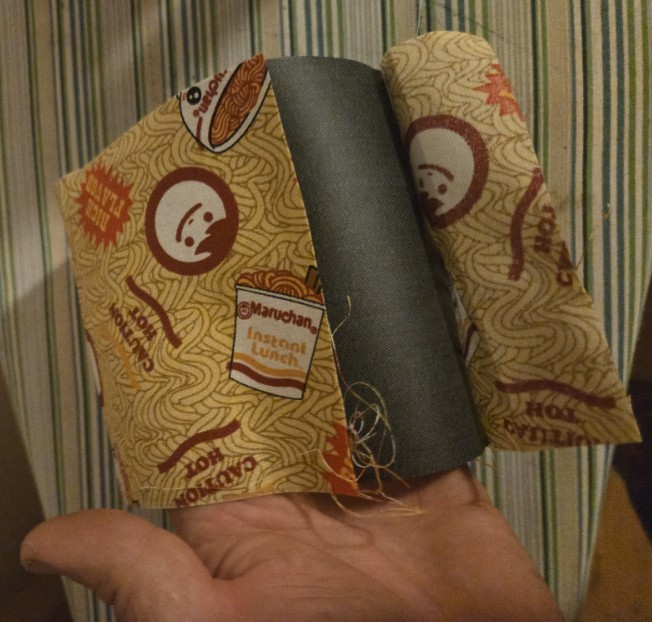
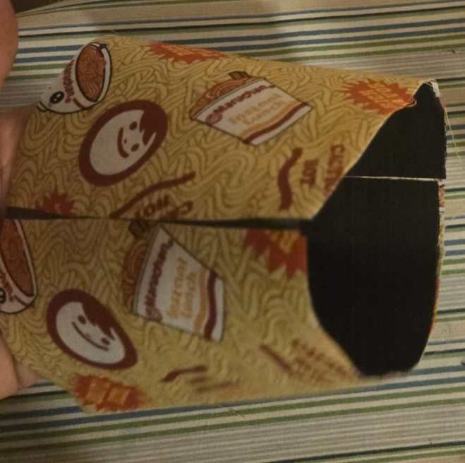
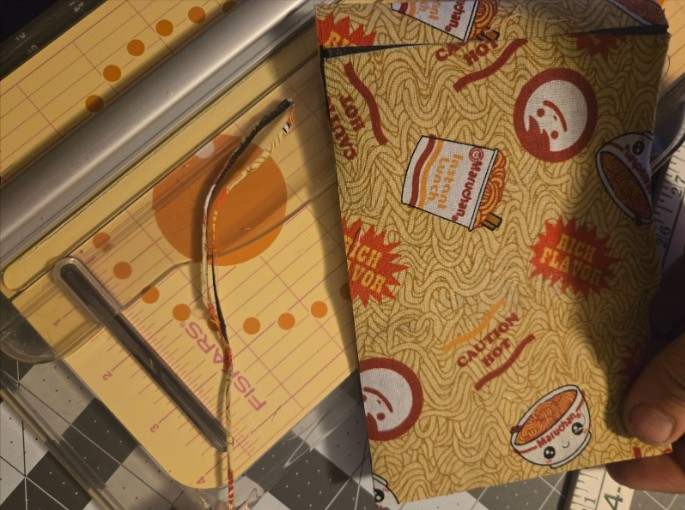

  
# BabyBelt Pro V2 - Fabric Belt Guide
BabyBelt Pro V2 by RobMink

Jump To...

- [Tools Needed](#Tools-Needed)
- [Consumable Materials](#Consumable-Materials)
- [Prepare Fabrics](#Prepare-Fabrics)
- [Join Fabrics](#Join-Fabrics)
- [Complete](#Complete)

## Tools Needed
- Clothes Iron
- Ironing board or other heat resistant surface
- Measuring device at least 16in/400mm long
- Fabric cutter or other tool for straight accurate cuts

[Jump to Top](#top)

## Consumable Materials
- Cotton Fabric https://amzn.to/3ZorLqo - any color/pattern as long as it is cotton
- Iron-on denim backing/patch https://amzn.to/3YQTHmS
- Kapton tape https://amzn.to/43Ar142 -OR- Aluminum/HVAC Tape https://a.co/d/2Tgutt0

## Prepare Fabrics
- Take your cotton fabric out and iron it out if it needs to have any creases removed.  Give it a pull in both directions.  One way will be stretchy and one way will not be.  We want the stretchy way to be the length and the non stretchy to be width.
- Take the fabric and cut out a **5 inch (125mm) wide by 15 inch (380mm)** long strip. 
- Take the iron-on and cut out a **5 inch (125mm) wide by 15.25 inch (385mm)** long strip of iron on. An extra .25 inch (5mm) is for shrinkage and to be removed to allow for a more “seamless” design.
- The iron-on shrinks so it needs to be slightly longer. 

- If your iron-on has a backing, remove it now.

- Use the kapton tape to join the iron-on together in a loop, glue side facing out.  The tape should **ONLY** be on the glue free side of the iron-on.

- Position the fabric lengthwise in front of you with the side you want visible face down.

[Jump to Top](#top)

## Join Fabrics
**Read all steps in this section before proceeding**
- Plug-in/heat-up your iron.
    - Usually the highest non-steam setting, follow any instructions that were included with your iron-on patch.
    - How hot the belt and iron-on get will be controlled by how long the iron is held on the belt.
- Take the iron-on loop and locate the taped seam.
- Align the taped seam of the loop to the **MIDDLE** of the length of fabric.
- Ensure the fabric and iron-on are aligned on the top and bottom.
- Starting at the taped joint in the middle of the fabric strip, use the tip of the iron to heat up the iron-on and bond it to the fabric.
    - We are mostly after alignment, so no need to get the iron-on very hot leaving.  Using light heat if a mistake is made it may be able to be peeled and re-attempted.

- Verify your iron-on and fabric are still evenly aligned at the top and bottom
- Working evenly outwards from the taped seam in both directions **and** top and bottom edges, continue to use the iron to lightly heat/adhere the iron-on to the fabric.
    - Keep in mind the iron-on patch will shrink while heating.
    - Ensure even light heating, look out for the belt trying to deform into a cone or loss of alignment between the fabric and iron-on.
    - **DO NOT GO ALL THE WAY TO THE FABRIC SEAM!** Leave 1-2 inches(25-50mm) on either side of the fabric seam.

- Cut away any frayed edges from both ends of the fabric.
    - Do not trim to length, overlaps can be dealt with after the iron-on is done.
- Switch from inside the belt to folding the belt and using the iron on the fabric side.
    - Make sure you do not crease the belt while ironing on the outside.
    - Make sure the fabric and iron-on remain aligned.
    - If the fabric is too long allow it to overlap.
- Work around the entire belt, from the outside with light amounts of heat.  
    - Apply heat, pick up the belt, rotate it and continue.

This is an acceptable seam.  The belt should look something like this after the initial passes.

- The fabric and iron-on should be aligned all the way around.  Most of the shrinking of the iron-on should also be done by now.
- To deep-set the bond on the remaining passes let the iron sit a bit longer so the belt gets really hot. It should be hot enough rotating it is a bit uncomfortable.
- Keep working around the belt getting it nice and hot until it seems like it is well bonded.
    - If any edges are loose, iron it more.
    - There should be a slight darkening of the fabric while the iron-on bonds properly to the fabric.
    - It is really hard to overdo it as long as the iron is not left in one spot long enough to burn.
- Trim off any light misalignments, frayed edges, or seam overlaps.
- Make one or two more good hot passes around the entire belt after any trimming.
- Make one more pass for good measure.

## Complete
Well done, you should now have a belt ready for installation.

[Jump to Top](#top)

