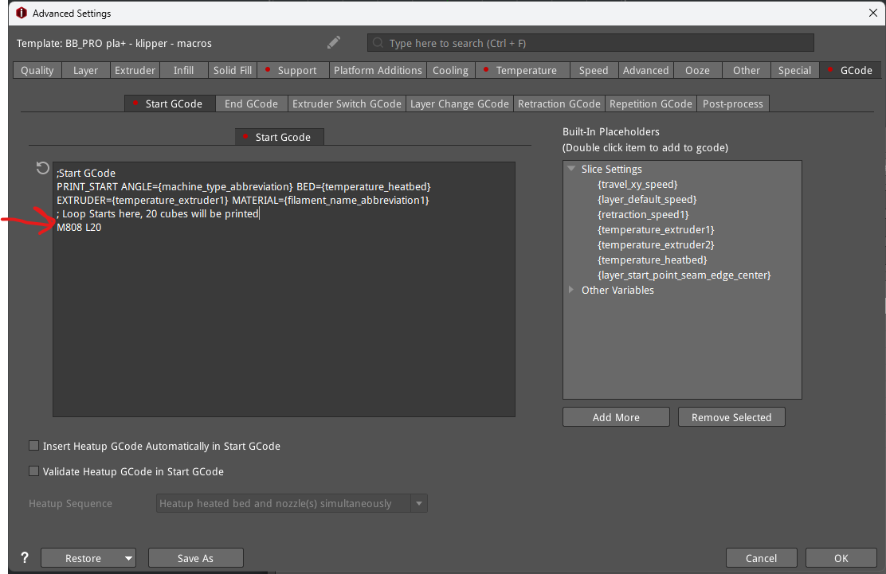
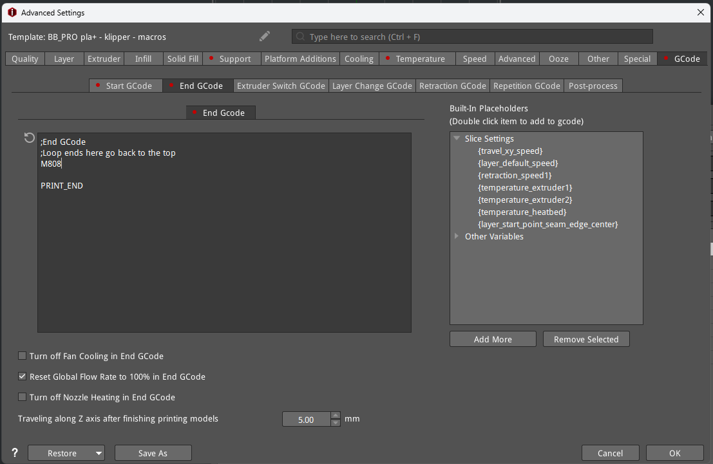
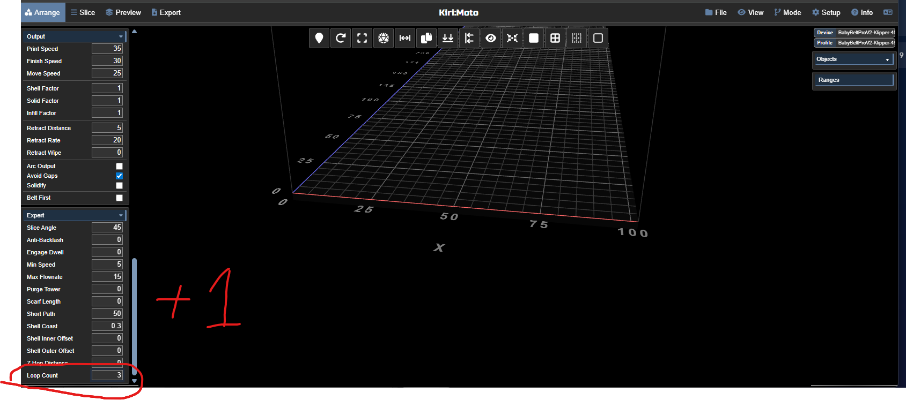
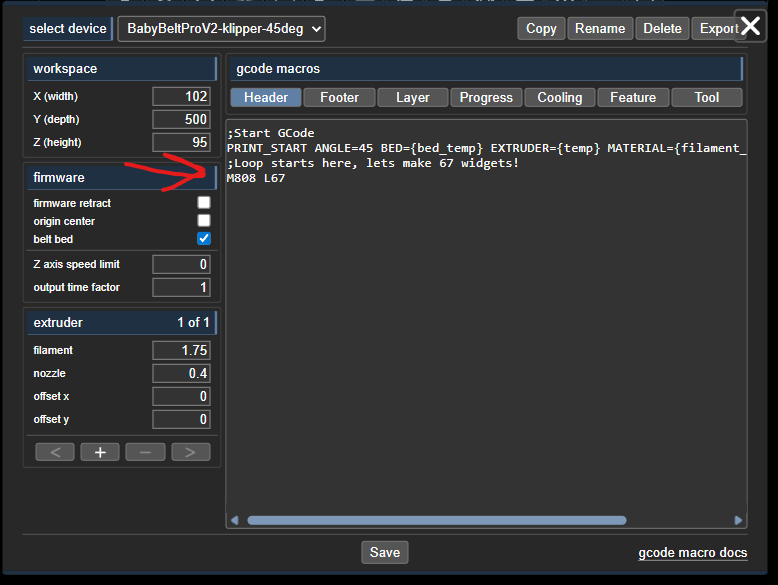
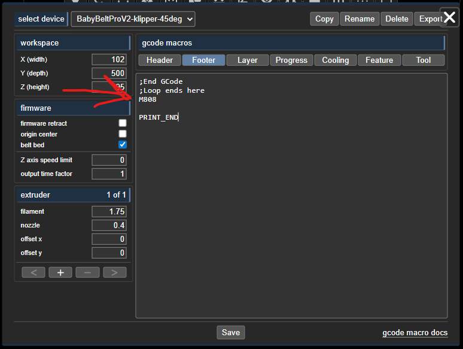

<a id="top"></a>  

# BabyBelt Pro - Loop Printing (M808)
Marlin FW implemented what they called [M808 - Repeat Marker]([https://marlinfw.org/docs/gcode/M808.html).  The purpose of this was basically to allow belt printers that would auto unload to print multiple copies of the same thing easily.  It works like a marker system.  where you want the loop to begin you insert M808 L\<number of loops\>, then where you want the loop to end you insert M808 and that increments the loop count and goes back up to the previous M808 L line. 

For Example, the gcode below would display "Hello World" to the console 5 times.
```
M808 L5
M117 Hello World
M808
```
## Implementing loops on your Baby Belt Pro
- Marlin FW should have this functionality from 2.0.8 onward, no implementation steps should be required.
- Klipper does not natively implement M808, but it can be mimicked with a macro.
    - Make sure [loop_prints.cfg](/Software/Firmware/klipper/options/loop_prints.cfg) is in your klipper options folder.  
    - Uncomment or add [include options/loop_prints.cfg] to printer.cfg near the top with the other includes.
    - Restart klipper and check for errors.
    - In the Baby Belt Pro macros as tested in April of 2026 the L value needs to be the number of prints you want.  1 prints once, 2 prints twice etc.

## Using M808

### Manual Edit
- Open a gcode file, someplace AFTER the startup macro call insert a line M808 L\<number of loops>.  This is the starting marker for the loop.
- At the end of the gcode file BEFORE your print end macro insert a line that just has M808.  This is the end marker for the loop, when this is reached the firmware will go up to the first M808 L\<number of loops> line it sees, increment the loop count and continue.

#### Example

```
; --- startup ---
;Start GCode
PRINT_START ANGLE=45 BED=0 EXTRUDER=210 MATERIAL=0
G1 E-5.0000 F1200 ; e-retract 5
; LOOP STARTS HERE, needs to be AFTER startup macros are called.
M808 L1
G92 Z0
;; --- layer 0 (0.200 @ 0.51) ---
M106 S255
;;***Whole bunch of gcode***
G1 X46.2000 F1500
; end object id: 101
;LOOP ENDS HERE, needs to be BEFORE end macros are called
M808
;End GCode
PRINT_END
; --- filament used: 194.31 mm ---
; --- print time: 1414s ---
```
### IdeaMaker
- IdeaMaker does not have a loop field that we know of, but adding loops to start and end gcode is easy enough.
- Start Gcode

- End Gcode



### KiriMoto
- KiriMoto does have a native field for loops, but for some reason it likes to subtract one from the number of loops entered.  At some point some firmware likely treated the first pass through the loop as index 0.  The loop Count box is in the Expert section on the bottom left.  filling this in will automatically inject M808 L\<Loop Count - 1> after the startup gcode and M808 before the end gcode.
- The same results can be accomplished using the start and end gcode in the machine profile in KiriMoto as well.

- Loop Count - Add 1 to this value, the slicer will subtract one.  2 gets one print, 3 gets 2 prints etc


- Start and End Gcode - Like with IdeaMaker the L value is the number of prints/loops that will result.






