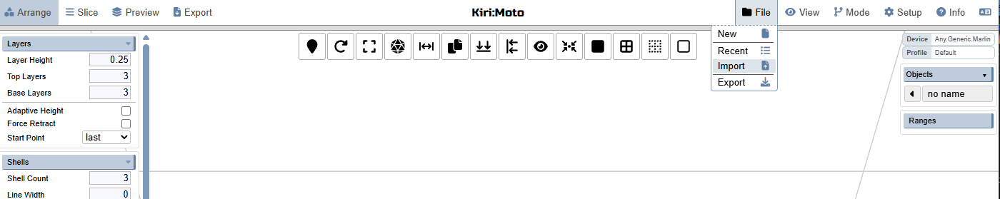
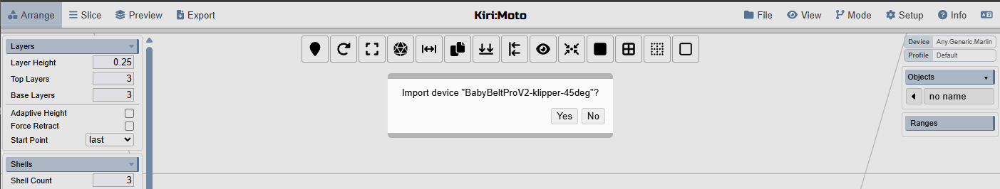
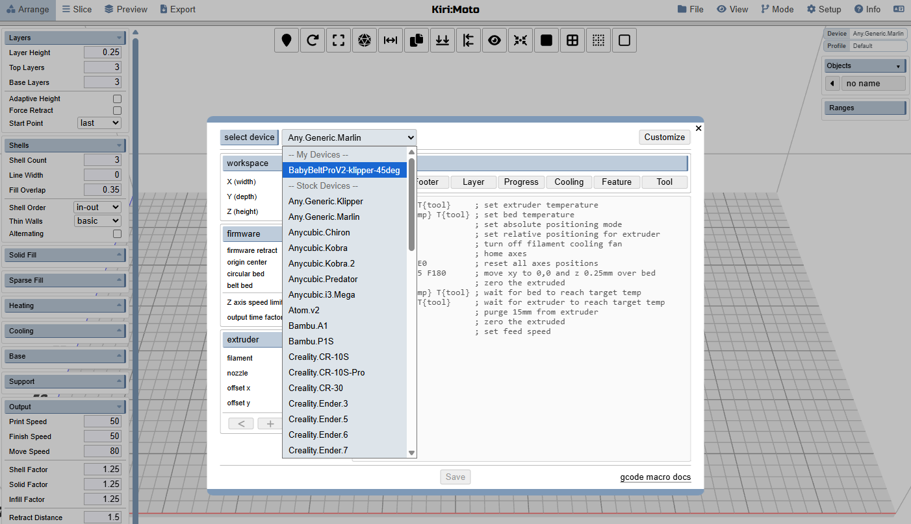
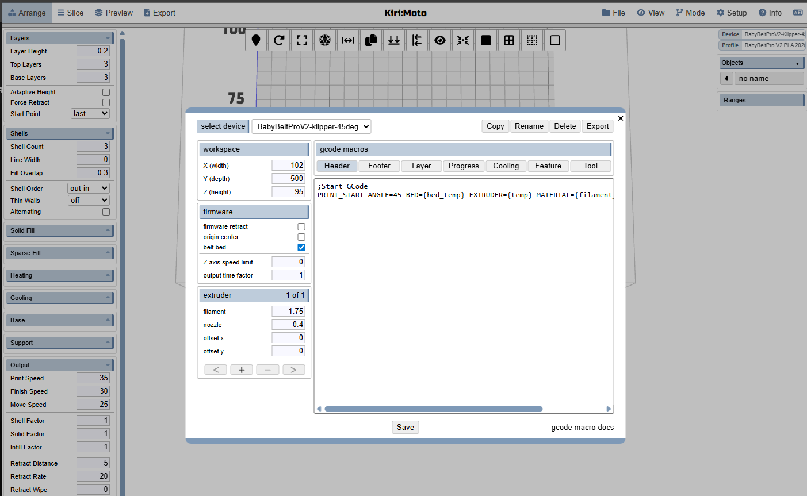

  

# BabyBelt Pro V2.5 - Slicer Setup Guide
Profiles and guidance are provided for two belt supporting slicers.  IdeaMaker and the web based Kirimoto. Ideamaker is a bit more popular however Kirimoto is completely functional for basic use.

## IdeaMaker

## KiriMoto
>[!CAUTION]
>KiriMoto does not properly generate gcode for 30 degree printing.  The Y axis drifts down eventually crashing into the bed and running into out of range motion.  Only use this slicer when in 45 degrees.

- Grab your desired profile from our [KiriMoto Profiles folder](/Software/Profile/KiriMoto/)
- Use your browser of choice and go to https://grid.space/kiri/
- Close the greeting screen and accept that the site will use cookies. Profiles and config are stored in them.
- Click on File and select Import

- Find your downloaded .km file and select it.  You will be prompted if you would like to import the device.

- Click yes and the device selection screen will come up.  Select your newly imported device from the drop down.

- The header(start) gcode macro should look roughly like this for klipper.

- Consult the KiriMoto documentation or their discord for further information.